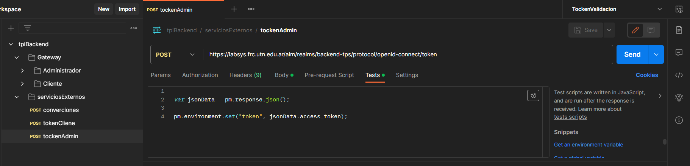
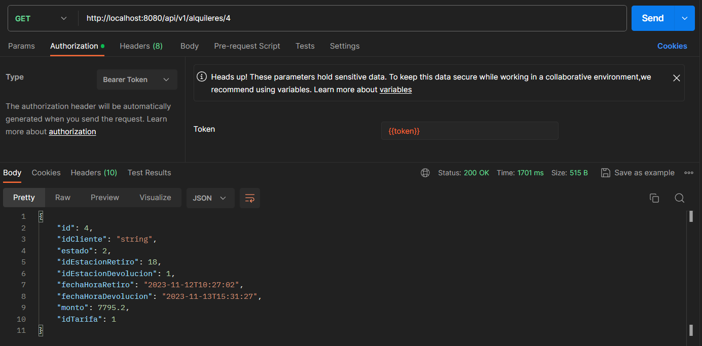

# TpiBackend
Este es un trabajo práctico integrador de la materia Backend de aplicaciones de la UTN FRC,
en el cual se nos pide la implementación de un sistema de alquiler de bicicletas para una
cierta ciudad. De acuerdo a nuestro modelo, el sistema opera bajo los siguientes supuestos:

- Llamamos cliente a la persona que está registrada en el sistema para alquilar bicicletas
- Cada bicicleta que se alquila es retirada de una estación y devuelta en una estación
  distinta
- Asumimos que siempre hay una bicicleta disponible en cada estación y que toda
  estación tiene lugar disponible para una devolución.
- El precio del alquiler se calcula en el momento de la devolución de la bicicleta y este
  precio se calcula bajo las siguientes reglas:
    - Hay un costo fijo por realizar el alquiler y un costo por hora completa (Cuenta
      como hora completa a partir del minuto 31, antes de eso se tarifa fraccionado
      por minuto). Existe una tabla en la base de datos que se provee que indica
      cuáles son estos costos por cada día de la semana
    - Se cobra un monto adicional por cada KM que separe la estación de retiro de
      la estación de devolución. La base de datos provista contiene el precio
      adicional por KM. El cálculo de esta distancia se explica en las aclaraciones
      finales
    - Para los días promocionales configurados en el sistema, se aplica un
      porcentaje de descuento sobre el monto total del alquiler. Para que este
      descuento se aplique, se considera que el retiro de la bicicleta se hizo en el
      día promocional. La base de datos provista contiene los días que se
      consideran de descuento y el descuento aplicable
  -Al momento de la devolución, el cliente decide en qué moneda se le va a mostrar el
      importe adeudado. Por defecto el monto se muestra en Pesos Argentinos, pero
      puede expresarse en cualquier otra moneda soportada por el sistema.

Se solicita desarrollar un backend, compuesto por microservices, que exponga un API
REST (con representación en JSON) para soportar, mínimamente, las siguientes
funcionalidades:
- Consultar el listado de todas las estaciones disponibles en la ciudad


- Consultar los datos de la estación más cercana a una ubicación provista por el
cliente.


- Iniciar el alquiler de una bicicleta desde una estación dada


- Finalizar un alquiler en curso, informando los datos del mismo y el costo expresado
en la moneda que el cliente desee. La moneda puede ser elegida en el momento de
finalizar el alquiler y, en caso de no hacerlo, el monto se expresa en pesos
argentinos.


- Agregar una nueva estación al sistema


- Obtener un listado de los alquileres realizados aplicando, por lo menos, un filtro

## Tener en cuenta que:

- El backend debe presentar un único punto de entrada (debe exponer todos los
  endpoints en el mismo puerto), para lo que deberá implementar una API Gateway


- Las llamadas a los distintos endpoints únicamente deben ser permitidas para
  clientes autenticados. Para esto, se consideran únicamente dos roles:
    - Cliente: puede realizar consultas sobre las estaciones, realizar alquileres y
      finalizar alquileres
  
    - Administrador: puede realizar todas las operaciones


- El backend debe implementar un mecanismo de autorización basado en JWT


- Todos los endpoints que se generen deben estar documentados utilizando Swagger


- Para calcular la distancia entre dos estaciones, se considerará simplemente la
distancia euclídea entre ambos puntos y cada grado corresponderá a 110000 m. Se
aclara que este cálculo no es correcto, pero es suficiente para los fines de este
Trabajo Práctico.

La Organizacion del proyecto es la siguiente:


La base de datos tiene la siguiente estructura:


## Como ejecutar el proyecto
Este proyecto está desarrollado con Java 17, Maven, Spring Boot y SQLite, por lo que para ejecutarlo
debemos tener estos instalados en nuestra máquina y ejecutarlos desde nuestro IDE de preferencia

También es posible ejecutarlo en un contenedor de docker

### Despliegue en docker

- Para desplegar el proyecto en un contenedor, debemos tener instalado previamente docker desktop


- Una ves que abrimos docker, podemos ir a la carpeta del proyecto, abrir una terminal y colocar el siguiente comando

````agsl
docker-compose up --build  
````

Este comando nos depliega el proyecto y en la terminal podremos visualizar los logs que se estén ejecutando de los 3 microservices

a este comando le podemos agregar **-d** para que lo ejecute en segundo plano y no nos muestre los logs

- Para detener podemos apretar ctrl + c o con el comando 

````agsl
docker-compose down
````
- Si se realizaron cambios en el codigo y queremos actualizar el proyecto, debemos ejecutar el siguiente comando


````agsl
mvn clean install
````
Esto nos actualizará el jar de Estaciones y Alquileres, y si los cambios son del Gateway, debemos ejecutar el mismo comando en la carpeta Gateway

Una vez que se actualizó el jar, debemos volver a ejecutar el comando de **docker-compose up --build**


### Despliegue en local

- Para desplegar el proyecto en local, debemos tener instalado previamente Java 17 y Maven
- Una ves que abrimos nuestro IDE, debemos importar el proyecto como un proyecto Maven
- Una vez que se importó el proyecto, debemos ejecutar el comando **mvn clean install** para que se descarguen las dependencias y se genere el jar
- Una vez que se generó el jar, debemos ejecutarlo desde la terminal con el comando **java -jar nombreDelJar.jar**
- Para ejecutar el proyecto de esta manera, debemos ejecutar primero el proyecto de Estaciones, luego el de Alquileres y por ultimo el de Gateway

**Otra forma es desde el IDE**


## Para probar los endpoints

En este proyecto se utilizó Swagger para documentar los endpoints, por lo que podemos probar los microservicios Alquiler y Estaciones de forma individual.
Por medio de Swagger podemos probar los endpoints de cada microservicio, pero para probar el Gateway, debemos utilizar Postman

### Probar los endpoints de Alquileres y Estaciones

- Una vez que se ejecutó el proyecto, podemos ir a nuestro navegador y colocar la siguiente url (Para Estaciones)

````agsl
http://localhost:8082/swagger-ui.html
````
- para proba los endpoints de Alquileres

````agsl
http://localhost:8081/swagger-ui.html
````
Una vez que se abrió la pagina de Swagger, podemos probar los endpoints de cada microservicio


### Probar los endpoints del Gateway

Para probar los endpoints del Gateway, debemos utilizar Postman, en este repositorio se encuentra una coleccion de postman con los endpoints del Gateway
- Accedemos a Postman y importamos la collection que se encuentra en el repositorio como **tpi.postman_collection**

Una vez que se importó la collection, podemos probar los endpoints de la siguiente manera

- 1) Primero debemos ir al endpoint **tokenCliente** o **tokenAdmin** para obtener el token de autenticacion



En este endpoint (ya configurada las variables de la peticion a keycloak), tenemos configurado un script que nos guarda el token en una variable global, 
por lo que no es necesario copiarlo y pegarlo en los otros endpoints

- 2) Una vez que tenemos el token, podemos probar los endpoints de los otros microservicios

